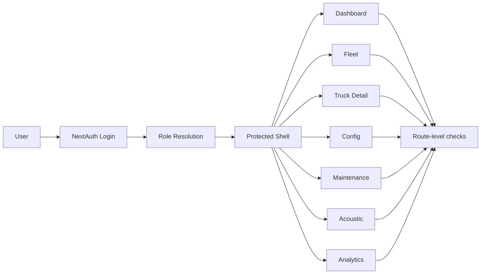
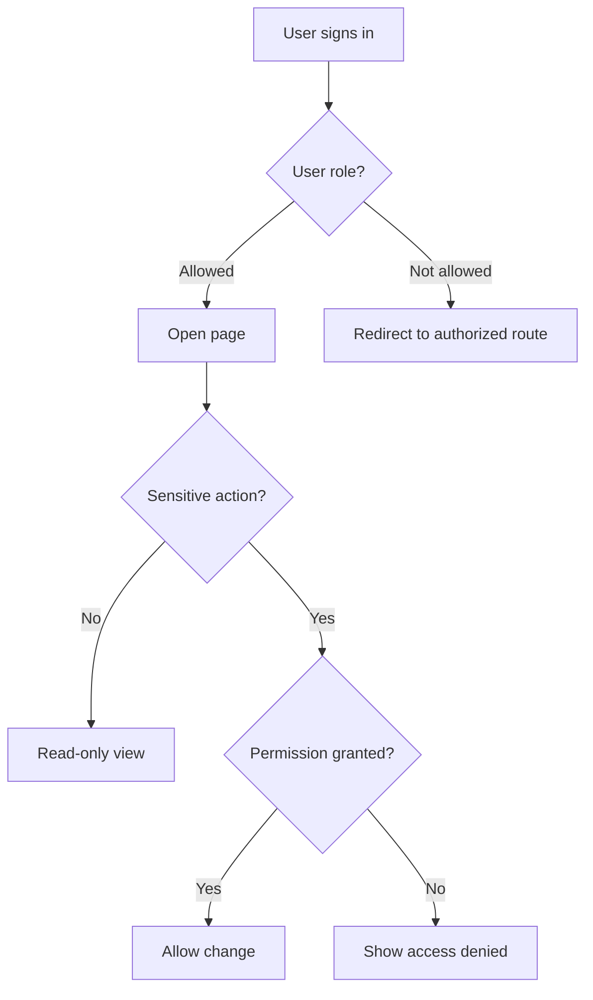

# SmartBed Detection System

SmartBed is a web dashboard for mining fleet teams. It helps detect carry-back risk, monitor truck/sensor health, and plan maintenance before failures become expensive.

This README is written for two audiences:
- Non-technical users: what the product does and how to use it day-to-day.
- Technical users: architecture, setup, routes, roles, and quality checks.

## 1) Quick Start

### 1.1 For anyone (2-minute overview)
1. Start the app.
2. Sign in with a demo user.
3. Open the Dashboard.
4. Move to Fleet, Truck Detail, Acoustic, Analytics, Config, or Maintenance based on your role.

### 1.2 For developers (terminal commands)
```bash
npm install
npm run dev
```

Validation commands:
```bash
npm run lint
npm run build
```

## 2) What Problem This Solves

Mining trucks often lose efficiency due to material carry-back, wear in truck beds, and delayed maintenance decisions.

SmartBed helps teams:
- Detect risk signals earlier.
- Understand fleet condition in one place.
- Investigate anomalies through acoustic and trend analysis.
- Configure thresholds and alerts by role.
- Plan predictive maintenance with better timing.

## 3) Non-Technical User Guide

### 3.1 Who uses SmartBed
- Super Admin: full system control.
- Site Manager: site-level oversight and controlled updates.
- Fleet Operator: fleet monitoring and truck-level operations.
- Truck Operator: assigned truck workflow.
- Maintenance Tech: maintenance planning and execution.
- Analyst: reporting, KPI interpretation, and trend insights.

### 3.2 Main pages in simple language
- Dashboard: your home screen and high-level status.
- Fleet: all trucks at once, with quick health signals.
- Truck Detail: one truck, deeper telemetry and condition view.
- Acoustic: signal-based anomaly investigation.
- Analytics: performance trends and reporting views.
- Config: thresholds, notification settings, and device-related controls.
- Maintenance: alerts, schedules, wear projections, and history.

### 3.3 Typical daily workflow
1. Open Dashboard for urgent alerts.
2. Check Fleet for priority trucks.
3. Open Truck Detail for specific investigation.
4. Use Acoustic/Analytics for confirmation and trends.
5. Plan actions in Maintenance.
6. Update Config only if your role allows it.

### 3.4 What each role should expect
- Some pages or actions are intentionally limited by role.
- This is not an error; it is a safety and governance control.
- If access is denied, use an account with the required permission level.

## 4) Demo Accounts

Source: `lib/mockData.ts`

Password for all users:
- `Password123!`

Accounts:
- `super.admin@smartbed.ai` | `SUPER_ADMIN` | site alpha
- `site.manager@smartbed.ai` | `SITE_MANAGER` | site alpha
- `fleet.operator@smartbed.ai` | `FLEET_OPERATOR` | site alpha
- `truck.operator@smartbed.ai` | `TRUCK_OPERATOR` | site alpha | assigned truck `793-11`
- `maintenance.tech@smartbed.ai` | `MAINTENANCE_TECH` | site beta
- `analyst@smartbed.ai` | `ANALYST` | site gamma

## 5) Technical Overview

### 5.1 Stack
- Next.js 14 (App Router)
- TypeScript (strict mode)
- Tailwind CSS
- NextAuth (credentials provider)
- Recharts (charts)
- Sonner (toasts)
- Lucide React (icons)
- jsPDF (report export)
- Zustand (UI state)

### 5.2 Directory map
- `app/`: route entry points and page-level wrappers.
- `components/`: feature modules and reusable UI.
- `lib/`: auth utilities, route/permission mapping, mock data.
- `store/`: application UI state.
- `types/`: shared type contracts.
- `backend/`: reserved backend workspace area.

### 5.3 Routing and page entry points
- `/dashboard`
- `/dashboard/fleet`
- `/dashboard/truck/[truckId]`
- `/dashboard/acoustic`
- `/dashboard/analytics`
- `/dashboard/config`
- `/dashboard/maintenance`

Additional high-level routes:
- `/legacy`
- `/platform`

### 5.4 Access control model
Permissions are enforced at multiple levels:
- Route-level role checks and redirects.
- Protected shell wrappers around pages.
- Action-level restrictions inside pages (read-only vs editable operations).

### 5.5 Architecture diagrams

The diagrams below summarize how the app is organized and how access is checked.





## 6) Route Access Summary

- `/dashboard`: role-aware landing.
- `/dashboard/fleet`: `FLEET_OPERATOR`, `SITE_MANAGER`, `SUPER_ADMIN`, `TRUCK_OPERATOR`, `ANALYST`.
- `/dashboard/truck/[truckId]`: role-guarded; `TRUCK_OPERATOR` limited to assigned truck.
- `/dashboard/acoustic`: role-gated diagnostics.
- `/dashboard/analytics`: reporting and KPI workflows.
- `/dashboard/config`: `SUPER_ADMIN`, `MAINTENANCE_TECH`, `SITE_MANAGER` with role-dependent edit scope.
- `/dashboard/maintenance`: `MAINTENANCE_TECH`, `SUPER_ADMIN`, `SITE_MANAGER` (schedule editing currently centered on maintenance tech workflow).

## 7) Feature Details

### 7.1 Configuration module
- Truck selector and model context.
- Sensor/control settings (load-cell, acoustic, camera, vibrator).
- Alert thresholds and recipients.
- Notification channels and webhook setup.
- Save scope by role (truck/model/fleet context).
- Calibration wizard and hardware topology interactions.

### 7.2 Maintenance module
- Alert panel with severity filters.
- Bed wear visualization and trend projections.
- Replacement horizon and cost-related summary.
- Schedule and inventory views.
- Technician workload visualization.
- Maintenance history filters (truck/type/date/search).
- Predictive insights with confidence and recommended action.

### 7.3 Analytics and acoustic modules
- Trend analysis and KPI charts.
- Acoustic anomaly exploration for deeper incident investigation.
- Reporting-oriented views for analyst and operations workflows.

## 8) Data Model and Simulation Notes

The current implementation uses mock and generated data for deterministic local behavior.

Why this is useful:
- Reliable local demos.
- Fast UI iteration.
- No mandatory backend dependency for core UI validation.

When integrating real services:
1. Replace mock providers in feature modules.
2. Keep route and permission guards intact.
3. Preserve existing TypeScript contracts in shared types.

## 9) Setup and Run

### 9.1 Requirements
- Node.js 18+
- npm 9+
- macOS, Linux, or Windows

### 9.2 Install dependencies
```bash
npm install
```

### 9.3 Development mode
```bash
npm run dev
```

### 9.4 Production build and start
```bash
npm run build
npm run start
```

### 9.5 Linting
```bash
npm run lint
```

## 10) Quality Status

As of 26 April 2026:
- `npm run lint` passes.
- `npm run build` passes.
- No current compile/type errors were detected across pages.

## 11) Troubleshooting

### 11.1 Hot reload/chunk issues during development
Symptoms:
- Missing chunk errors.
- Random route 500s.

Fix:
1. Stop the dev server.
2. Remove `.next` cache directory.
3. Restart with `npm run dev`.

### 11.2 Authentication callback confusion on changing ports
If auth looks inconsistent:
- Keep one dev port consistent during a session.
- Clear stale cookies/session and sign in again.

### 11.3 Access denied on route or action
Expected in role-restricted flows.

Check:
- Role assigned to your user account.
- Allowed roles in route wrappers.
- Action-level permission checks in page components.

## 12) Security Notes (Before Real Production)

- Replace demo credentials with a real identity provider.
- Use secure environment variables for secrets.
- Add server-side authorization for all write operations.
- Add request validation and rate limiting on mutable endpoints.
- Add audit logging for configuration and maintenance changes.

## 13) Recommended Team Workflow

1. Pull latest changes.
2. Install dependencies.
3. Run `npm run lint` and `npm run build`.
4. Start dev server and validate role-based flows using demo users.
5. Spot-check key modules: Fleet, Truck Detail, Acoustic, Analytics, Config, Maintenance.

## 14) Known Scope and Future Improvements

Current scope:
- Frontend-heavy implementation with role-aware navigation and workflows.
- Strong support for demos and feature exploration.

Good next steps:
- Connect telemetry and maintenance APIs.
- Persist schedules/history to backend storage.
- Add unit/integration tests for critical role-sensitive logic.
- Add observability for auth, redirects, and page/action latency.

## 15) Glossary (Simple Terms)

- Carry-back: leftover material staying in truck bed after unload.
- Telemetry: live machine/sensor data.
- Predictive maintenance: servicing equipment before failure based on data patterns.
- Role-based access: features available depending on user role.
- KPI: key performance indicator used to track operational performance.
